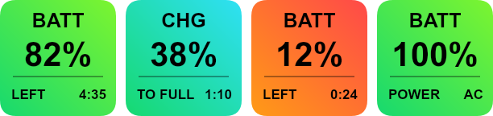

# Mac System Monitor — StreamDock Plugin

Live **Mac CPU, GPU, memory, storage, network and battery** stats on StreamDock keys. A lightweight
system / hardware monitor for **Ajazz** and **Mirabox** StreamDock decks on
**Apple Silicon** (M1 / M2 / M3 / M4) — a free alternative to Elgato Stream Deck
system-monitoring plugins.


## Features

- **Mac Performance Monitor** — alternates CPU, GPU and RAM information every 3 seconds.
- **Mac CPU Monitor** — standalone CPU usage and temperature.
- **Mac GPU Monitor** — standalone GPU usage and temperature.
- **Mac RAM Monitor** — standalone memory usage and available memory.
- **Mac Battery Monitor** — battery level %, charging state, and time remaining
  (or time to full). MacBooks only.
- **Mac Storage Monitor** — mounted storage usage, free space and volume name.
- **Mac Network Monitor** — live download and upload speeds.
- Per-key color thresholds for warning, critical usage, temperature and battery.
- A visual alert alternates between warning colors every third of a second when
  battery charge is low or CPU/GPU temperature is high.
- Seven actions are available in Information: combined Performance, standalone
  CPU, GPU and RAM, plus Storage, Battery and Network.
- Performance, Battery, Storage and Network are also available in Keypad.
- Color-coded key icon: green → yellow → red as load rises (inverted for battery —
  low charge turns red, charging turns cyan).
- **Self-contained** — no network server, no LaunchAgent, no `sudo`, no external
  install. Starts and stops with the plugin.
- Reads sensors through a bundled copy of [macmon](https://github.com/vladkens/macmon)
  (MIT) plus the built-in `pmset` for battery, so no kernel extension or admin
  rights are needed.



## Requirements

- Apple Silicon Mac (M1 or newer) — `macmon` does not support Intel Macs.
- macOS 11 or later.
- StreamDock app 3.10+ (Ajazz AKP03 / AKP153, Mirabox 293 / 293S, and other
  StreamDock-compatible decks).

## Install

```
git clone https://github.com/Karaar89/macmonitor-sdplugin.git com.karaar.macmonitor.sdPlugin
cd com.karaar.macmonitor.sdPlugin/plugin && npm install
```

Move the `com.karaar.macmonitor.sdPlugin` folder into StreamDock's `plugins/`
directory and restart the StreamDock app. Then drag any combined or standalone
monitor action onto an Information key.

Prefer a ready-to-run build? Grab the zip from
[Releases](https://github.com/Karaar89/macmonitor-sdplugin/releases) — it already
contains `node_modules`, so just unzip into `plugins/` and restart StreamDock.

## How it works

- `manifest.json` — plugin and action definitions (`CodePathMac`, `Nodejs` version).
- `plugin/index.js` — the backend. Runs as a real Node.js subprocess (StreamDock's
  bundled Node 20), registers over the standard WebSocket protocol, and redraws
  the key icon with [`@napi-rs/canvas`](https://github.com/Brooooooklyn/canvas)
  once per second.
- `plugin/bin/macmon` — a bundled, unmodified copy of
  [macmon](https://github.com/vladkens/macmon) (MIT license, see
  `plugin/bin/THIRD_PARTY_NOTICES.md`), run as `macmon pipe -i 1000`.
- Battery data comes from macOS's built-in `pmset -g batt`, polled every 10 s.

## License

MIT — see [LICENSE](LICENSE). Bundles `macmon` under the MIT license; see
`plugin/bin/THIRD_PARTY_NOTICES.md`.
