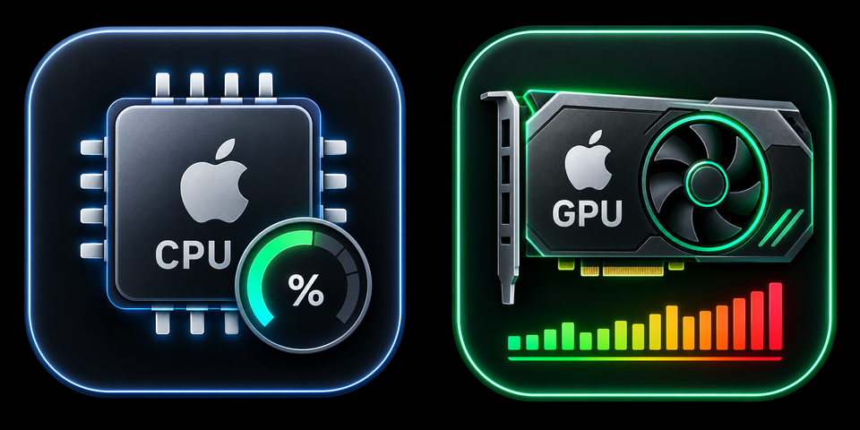

# Mac System Monitor — StreamDock Plugin

Live **Mac CPU & GPU usage and temperature** on a StreamDock key. A lightweight
system / hardware monitor for **Ajazz** and **Mirabox** StreamDock decks on
**Apple Silicon** (M1 / M2 / M3 / M4) — a free alternative to Elgato Stream Deck
system-monitoring plugins.



## Features

- **Mac CPU Monitor** — live usage % and package temperature, redrawn once per second.
- **Mac GPU Monitor** — live usage % and temperature for the Apple Silicon GPU.
- Color-coded key icon (green → yellow → red) as load rises.
- **Self-contained** — no network server, no LaunchAgent, no `sudo`, no external
  install. Starts and stops with the plugin.
- Reads sensors through a bundled copy of [macmon](https://github.com/vladkens/macmon)
  (MIT), so no kernel extension or admin rights are needed.

## Requirements

- Apple Silicon Mac (M1 or newer) — `macmon` does not support Intel Macs.
- macOS 11 or later.
- StreamDock app 3.10+ (Ajazz AKP03 / AKP153, Mirabox 293 / 293S, and other
  StreamDock-compatible decks).

## Install

```
git clone https://github.com/Karaar89/macmonitor-sdplugin.git com.karaar.macmonitor.sdPlugin
cd com.karaar.macmonitor.sdPlugin/plugin && npm install
```

Move the `com.karaar.macmonitor.sdPlugin` folder into StreamDock's `plugins/`
directory and restart the StreamDock app. Then drag **Mac CPU Monitor** or
**Mac GPU Monitor** onto a key.

Prefer a ready-to-run build? Grab the zip from
[Releases](https://github.com/Karaar89/macmonitor-sdplugin/releases) — it already
contains `node_modules`, so just unzip into `plugins/` and restart StreamDock.

## How it works

- `manifest.json` — plugin and action definitions (`CodePathMac`, `Nodejs` version).
- `plugin/index.js` — the backend. Runs as a real Node.js subprocess (StreamDock's
  bundled Node 20), registers over the standard WebSocket protocol, and redraws
  the key icon with [`@napi-rs/canvas`](https://github.com/Brooooooklyn/canvas)
  once per second.
- `plugin/bin/macmon` — a bundled, unmodified copy of
  [macmon](https://github.com/vladkens/macmon) (MIT license, see
  `plugin/bin/THIRD_PARTY_NOTICES.md`), run as `macmon pipe -i 1000`.

## License

MIT — see [LICENSE](LICENSE). Bundles `macmon` under the MIT license; see
`plugin/bin/THIRD_PARTY_NOTICES.md`.
